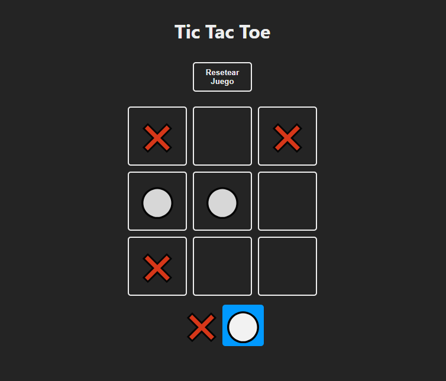

# Juego de Tres en Raya

### Descripción
Este es un sencillo juego de tres en raya (tic-tac-toe) desarrollado con React. Permite a dos jugadores alternar turnos para marcar una cuadrícula de 3x3, con el objetivo de alinear tres de sus símbolos en fila, columna o diagonal.

### Tecnologias

- React **(Hook useState)**
- CSS

### Instalación

1. Clona este repositorio:

```bash
git clone https://github.com/silfarias/Game_TicTacToe.git
```

2. Navega al directorio del proyecto

```bash 
    cd Game_TicTacToe
```

3. Instala las dependencias
```bash 
    npm install
```
4. Inicia la aplicación
```bash 
    npm run dev
```

### Uso

- Dos jugadores se alternan para seleccionar casillas.
- El primer jugador utiliza el símbolo 'X' y el segundo 'O'.
- El objetivo es alinear tres símbolos iguales en una fila, columna o diagonal.

### Captura del juego
